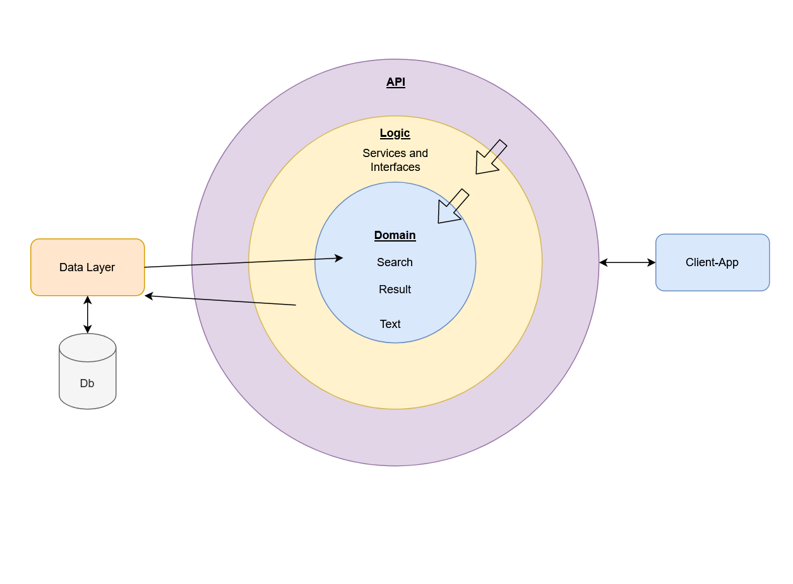

# 


## Table of contents
* [General info](#general-info)
* [Technologies](#technologies)
* [Setup](#setup)

## General info
SEO Analyzer - This is a small project I created to analyse the SEO results of a search term in google. 
The project is devide in two, server app(backend) and client app(front-end). on The backend project I used C# and .Net to create a Domain Driven Architecture, where the ceneter of the aplication is the Entities. 




-- Data Layer --

This was coded in a code-first approach levereging EntitiFramwork as a ORM ad usign its Migrations to create and update the Database. 
The data base initialy contains only two entities: Searches and Results in 1 to 1 relationship.

-- Logic Layer --

In the Logic layer of the Architecture I'm using a Services classes where I define the Interfaces that will be consumed by the API and that will be able to make make changes to the database context. This way the software is very safe, scalabe and easy to mantain beacause its possible to add and remove services and just allow their Interfaces to be consumed. At the moment there is only one Service to make the google search and get back the position based on the search term and the url the user is willing to analyze.

-- API -- 
Although its a simple application I decided to code a API to receive and send requests. This api endpoints then can be called by any kind of Client Application, making the system completely flexible and with separation of concerns. Here I decide to use a React application and making calls to this API to send and receive data.

-- React App --

The front-End application is very simple at this point in time. I decide to use React instead of a simple .NetCore WebApp exactly to make the system more separate.
I havente used React in a whiel so given more time this can app can grow. Because of the structure behind this system is very scalable, every search and result is receive from the web is saved on the database, it allows to make analisys in top of those results with simple Axios calls. Used Axios to Call my API, from the API the Service on the Logic layer is called.


	
## Technologies
Project is created with:
* C# / .Net5 / EntityFramework for the back-end.
* React.js for the front-end.
	
## Setup
To run this project, install it locally using npm:
$ cd ../lorem
$ npm install
$ npm start
```
